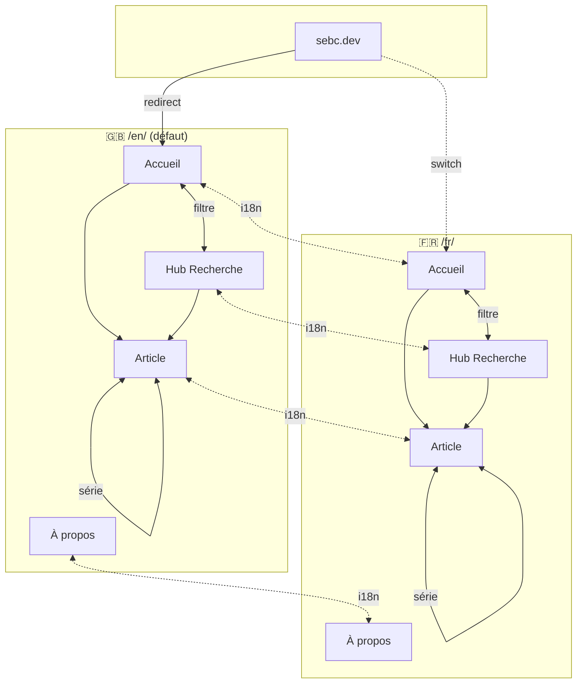

# sebc.dev — Architecture de l'Information

**Projet :** Blog technique personnel  
**Date :** 06/02/2025  
**Phase :** 3 — Conception  
**Statut :** Lecture

---

## 1. Taxonomie

### 1.1 Catégories (Formats de contenu)

Chaque article appartient à **une seule catégorie** qui définit son format éditorial.

|Catégorie|Description|Exemple d'usage|
|---|---|---|
|**Actualités**|Veille technologique, nouveautés, tendances émergentes|"Claude 4 : ce qui change pour les développeurs"|
|**Analyse Approfondie**|Décryptage technique détaillé, études comparatives|"RAG vs Fine-tuning : analyse comparative"|
|**Parcours d'Apprentissage**|Processus d'apprentissage complet documenté (série)|"Apprendre Astro — Partie 1/5"|
|**Rétrospective**|Bilans d'apprentissage, leçons retenues, recommandations|"6 mois avec Claude Code : le bilan"|
|**Tutoriel**|Guides pratiques étape par étape|"Déployer un site Astro sur Cloudflare"|
|**Étude de Cas**|Applications concrètes, résolution de problèmes réels|"Comment j'ai optimisé le LCP de 4s à 1.2s"|
|**Astuces Rapides**|Tips pratiques, optimisations, raccourcis|"5 raccourcis Claude Code méconnus"|
|**Dans les Coulisses**|Processus de création, méthodologie, outils|"Mon workflow de rédaction IA-assistée"|
|**Test d'Outil**|Évaluations détaillées d'outils et technologies|"Cursor vs Claude Code : verdict après 30 jours"|

### 1.2 Tags

#### Tags Piliers (obligatoires)

Chaque article doit avoir **au moins un tag pilier** correspondant au trio thématique du blog.

|Tag|Scope|
|---|---|
|**IA**|Intelligence artificielle, LLMs, prompting, agents, automatisation|
|**Ingénierie**|Développement, architecture, performance, DevOps, code|
|**UX**|Expérience utilisateur, design, accessibilité, ergonomie|

#### Tags Spécifiques (organiques)

Ajoutés selon le contenu. Exemples initiaux :

- **Technologies** : Astro, Cloudflare, MDX, Tailwind, TypeScript
- **Outils** : Claude, Claude Code, Cursor, Penpot, Figma
- **Concepts** : Performance, Accessibilité, SEO, i18n, Mobile-first

### 1.3 Règles d'attribution

```
1 catégorie (obligatoire)
+ 1-3 tags piliers (au moins 1 obligatoire)
+ 0-5 tags spécifiques (recommandé : 2-3)
```

**Exemple :**

- Article : "Déployer un site Astro sur Cloudflare"
- Catégorie : `Tutoriel`
- Tags piliers : `Ingénierie`
- Tags spécifiques : `Astro`, `Cloudflare`, `Performance`

### 1.4 Séries (Parcours d'Apprentissage)

Les articles de catégorie "Parcours d'Apprentissage" appartiennent à une série identifiée par :

- Un **identifiant de série** (ex: `learning-astro`)
- Un **numéro d'épisode** (1, 2, 3...)
- Un **total d'épisodes** (peut évoluer)

Cela permet la navigation inter-épisodes dans la page Article.

---

## 2. Sitemap

### 2.1 Structure des URLs

|Page|URL EN (défaut)|URL FR|
|---|---|---|
|Accueil|`/en/`|`/fr/`|
|Hub Recherche|`/en/search`|`/fr/recherche`|
|À propos|`/en/about`|`/fr/a-propos`|
|Article|`/en/articles/[slug]`|`/fr/articles/[slug]`|

**Redirection racine :** `sebc.dev` → `/en/` (anglais par défaut)

### 2.2 Pages

#### Accueil (`/en/` · `/fr/`)

|Élément|Description|
|---|---|
|Liste articles|Cartes avec : titre, date, temps de lecture, catégorie, tags|
|Filtres|Catégories et tags cliquables → Hub avec filtre pré-appliqué|
|Pagination|Si nécessaire (à définir selon volume)|

#### Hub Recherche (`/en/search` · `/fr/recherche`)

|Élément|Description|
|---|---|
|Recherche full-text|Pagefind (côté client)|
|Filtres combinables|Catégories (single select) + Tags (multi select)|
|Résultats dynamiques|Mise à jour côté client sans rechargement|
|État URL|Filtres reflétés dans l'URL (partageables)|

**Point d'entrée unifié :** Tout clic sur catégorie ou tag depuis n'importe quelle page → Hub avec filtre correspondant pré-appliqué.

#### À propos (`/en/about` · `/fr/a-propos`)

|Élément|Description|
|---|---|
|Présentation|Parcours personnel|
|Philosophie|Learn in public, trio IA × Ingénierie × UX|
|Liens sociaux|Twitter/X, LinkedIn, GitHub, dev.to|

#### Article (`/en/articles/[slug]` · `/fr/articles/[slug]`)

|Élément|Description|
|---|---|
|Contenu MDX|Rendu HTML avec composants interactifs|
|Syntax highlighting|Shiki (intégré Astro)|
|Table des matières|Générée depuis les headings|
|Progress bar|Indicateur d'avancée au scroll|
|Métadonnées|Date, temps de lecture, catégorie, tags|
|Partage|Twitter/X, LinkedIn, dev.to, copier lien|
|Navigation série|Épisode précédent/suivant (si Parcours d'Apprentissage)|
|Lien i18n|Vers la version traduite|

### 2.3 Diagramme



---

## 3. Navigation

### 3.1 Navigation Globale (header)

Persistante sur toutes les pages. Maximum 5 éléments.

|Position|Élément|Comportement|
|---|---|---|
|Gauche|Logo|Lien → Accueil (`/en/` ou `/fr/` selon langue active)|
|Centre/Droite|Recherche|Lien → Hub Recherche|
|Centre/Droite|À propos|Lien → À propos|
|Droite|Switch FR/EN|Bascule vers équivalent i18n de la page courante|

### 3.2 Navigation Locale (contextuelle)

|Page|Navigation locale|
|---|---|
|Accueil|Filtres catégories/tags (liens vers Hub)|
|Hub Recherche|Barre recherche + filtres actifs|
|Article|TOC (ancres), nav série (si applicable), tags cliquables|
|À propos|Liens sociaux|

### 3.3 Footer

|Élément|Contenu|
|---|---|
|Liens sociaux|Twitter/X, LinkedIn, GitHub, dev.to|
|Copyright|© 2025 Negus Salomon|
|Lien légal|Mentions légales (si nécessaire)|

### 3.4 Comportements

|Interaction|Résultat|
|---|---|
|Clic catégorie (depuis Accueil ou Article)|→ Hub avec filtre catégorie pré-appliqué|
|Clic tag (depuis Accueil ou Article)|→ Hub avec filtre tag pré-appliqué|
|Switch langue|→ Page équivalente dans l'autre langue (même slug)|
|Clic épisode suivant/précédent|→ Article de la série|

---

## 4. Checklist Validation

- [x] Taxonomie définie (9 catégories + 3 tags piliers)
- [x] Règles d'attribution documentées
- [x] Mécanique séries spécifiée
- [x] Structure URLs validée
- [x] Pages et contenus listés
- [x] Parcours utilisateurs identifiés
- [x] Navigation globale définie (≤5 éléments)
- [x] Comportements documentés

---

## 5. Prochaine étape

→ **Wireframes mobile-first** des 4 pages (Accueil, Hub, Article, À propos)

---

_Document généré le 06/02/2025 — Phase 3 Conception_
